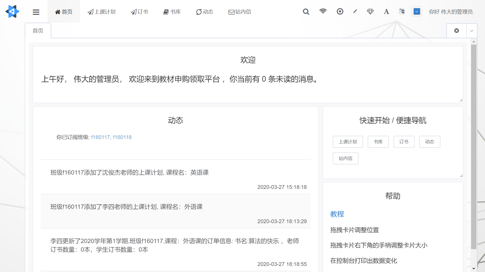
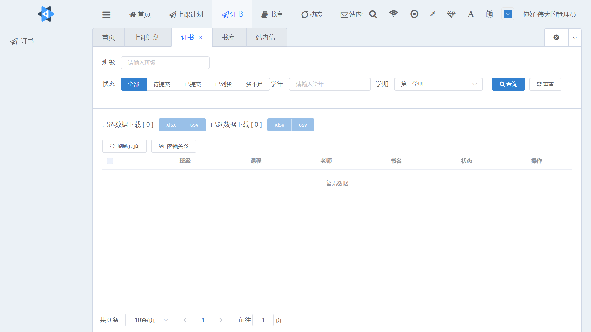
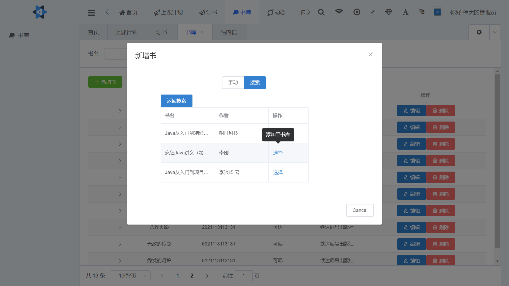
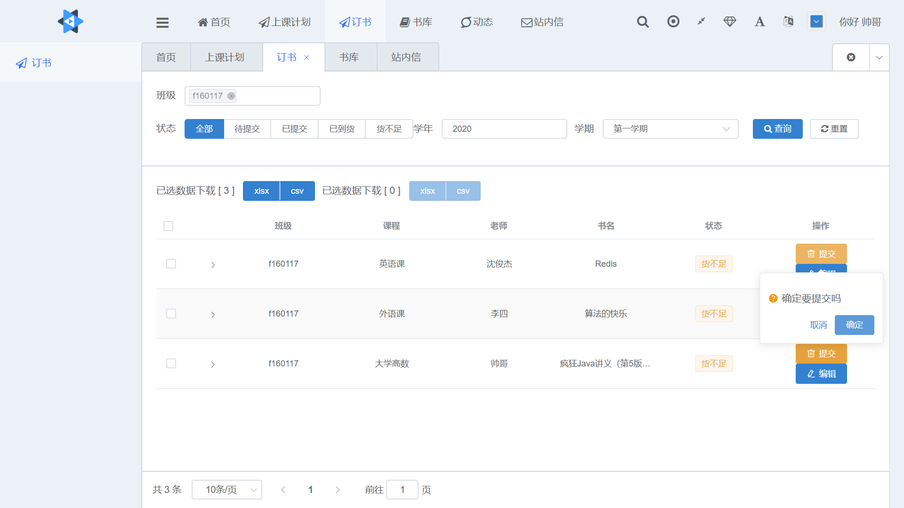

# 教材申购领取平台
这是一个为教师与教材部设计的方便教材申购领取平台。

前台使用d2-admin-start-kit框架搭建，后台使用SpringBoot搭建。
## 简介
平台分为两个角色，教师和教材部，教师负责申请订书，教材部在接收订书请求后向出版社订书，获得结果后在平台录入实际到货数量。

支持网络爬虫搜索书籍、导出订书信息excel、定时自动更新书库、站内信/邮件通知等


## 预览图







## 快速开始
>**前台:**
>进入目录:booking-platform\booking-platform-web

```
npm install
```

```
npm run serve
```

>**后台:**
>视情况修改配置文件,位于:src/main/resources/application.yml

**mysql**
运行sql目录下db.sql的ddl,可据实际情况往class与institute表插入对应信息。

**redis**
本地启动


import gradle changes
或执行
```
gradle build
```
如需开启邮件功能，请修改后台resource/application.yml文件中的spring.mail下属性

运行src/main/java/cn/shenjunjie/booking/BookingPlatformApplication.java的main方法


